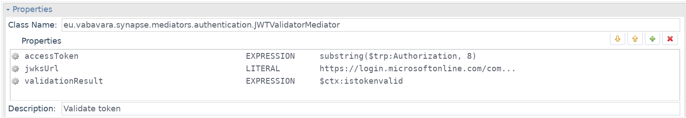

# JWT Validator Mediator for Apache Synapse

This project aims to provide a mediator that would give Apache Synapse sequences ability to validate JWTs (e.g. OIDC access tokens). It is set up as a Maven project - just use `mvn package` or `mvn install` to build a jar or install it to your local Maven repository.

## Installation with WSO2

Just copy the jar and jose4j jar (see [Dependencies](#Dependencies)) into WSO2 lib folder.

## Usage with WSO2 EI

1. Add a class mediator to the sequence.
2. Specify  `eu.vabavara.synapse.mediators.authentication.JWTValidatorMediator` as the class name.
3. Add properties to configure the behaviour of the handler:
    * accessToken - Access token to validate.
    * jwksUrl - URIs of the keyws page of your auhtentication provider. This URI is usually published in `\[Issuer URL\]/.well-known/openid-configuration` resource.
    
    ```xml
    <!-- Example of configuration with Azure AD. -->
    <class description="Validate token" name="eu.vabavara.synapse.mediators.authentication.JWTValidatorMediator">
        <property expression="substring($trp:Authorization, 8)" name="accessToken"/>
        <property name="jwksUrl" value="https://login.microsoftonline.com/common/discovery/keys"/>
    </class>
    ```
3. The mediator will fault the sequence and specify HTTP 401 Unauthorized response should be returned in case the token validaion fails. It is up to the application to conduct further checks (e.g. validate issuer, audience, application and subject).

## Dependencies

This project uses reference implementation of OpenID Connect: [https://bitbucket.org/b_c/jose4j/src/master/].
    
## Usage terms

You are free to use this component as long as you refer to this project.
